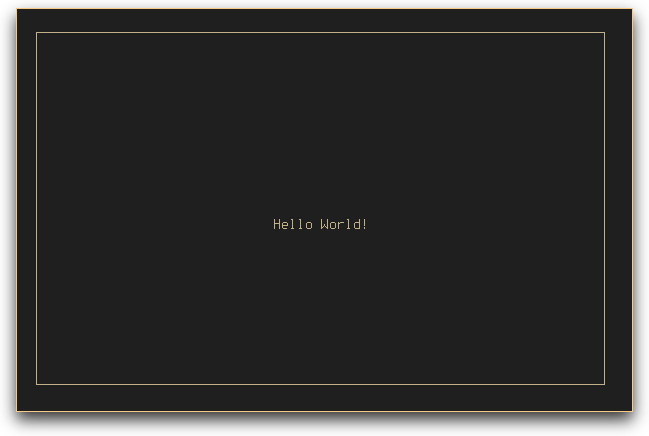

# term-ui
A node.js library providing a simple API to create widget based terminal applications.
This module does not provide any widgets on its own. You may want to check out [term-ui-common](https://npmjs.org/package/term-ui-common) for that.

The library is written in TypeScript. Therefore the examples below use ES6/Typescript syntax.
Full documentation can be found at ~~[paulavery.github.io/term-ui](paulavery.github.io/term-ui)~~ (once [typedoc](http://typedoc.io/) properly works with TS1.5).

## Example


**Code:**
```ts
import App from 'term-ui';
import {Text, Border, Position} from 'term-ui-common';

//Create the app
let app = new App();

//Create some text
let hello = new Text('Hello World!');

//Center it and Border it
hello = new Border({}, new Position({x: '50%-6', y: '50%'}, hello));

//Set up the app
app.addView('hello', hello);
app.on('CTRL_C', () => app.stop());

//Start the app
app.start();
```

## Intentions
I created this out of a frustration with the [blessed](https://npmjs.org/package/blessed) package.
Blessed is quite complex and especially implementing new Widgets seemed harder than it should.
In addition properly handling focus seemed rather complicated.

All of this obviously comes from the fact, that blessed is very feature-rich and powerful.
Therefore I decided, to create my own solution, with less features and a little bit more focussed approach.
I also decided to go with an idea of composable elements. This should hopefully reduce complexity.

And before you are wondering. Yes I realize this is basically a manifestation of [NIH](https://en.wikipedia.org/wiki/Not_invented_here) but hey, it is a great way for me to get more accustomed to typescript and corresponding build processes.

## Elements, Buffers and Focus
More detailed information about creating Elements and the lower-level concept of TerminalBuffers can be found [here](doc).
Information about focus handling can be found there as well.

## Application
The main logic is encapsulated in the `Application` class. It is used to handle views and to abstract away all the low-level terminal related stuff. Its basic working can be found in the example above. The full documentation can be found [here](paulavery.github.io/term-ui).

```ts
let a = new App();
```

### Methods
```ts
a.addView(name:string, view:Element): void
```
Add a named view to your application. A view is represented by a single element which will be rendered into the full width and height of the terminal.

```ts
a.showView(name:string): void
```
Load a specific view. The first view added is loaded automatically.

```ts
a.start(): void
```
Attach the application to the users console and rerender automatically when needed.

```ts
a.stop(): void
```
Detach the application and exit the node process.

### Events
The application emits a `key` event with a key identifier as its only argument. These identifiers are also emitted on their own and are identical to the ones emitted by [terminal-kit](https://www.npmjs.com/package/terminal-kit#ref.event.key).

## Contributing/Future plans
I am pretty happy with the external design of this framework (the basic application and composing of elements). But the internals (especially focus handling) is not neccessarily final as I am not entirely happy with it yet. But if you currently have any problems or suggestions (or god forbid, code? Oh god somebody please write tests for me) you are welcome to open an issue to discuss them. This includes major architectural changes.
